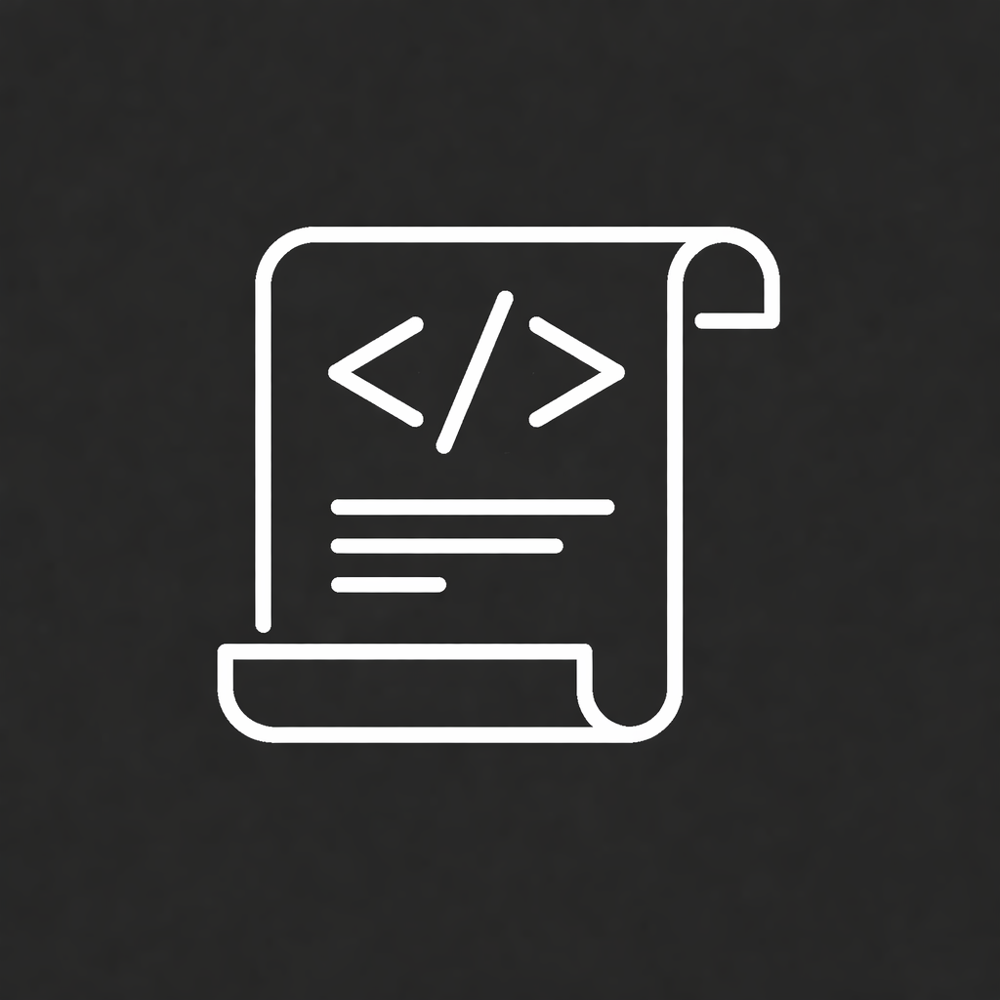

  
   
  Scrollearn

---

A sleek, minimal iOS app for mastering programming fundamentals through swipeable flashcards.

---

## ✨ Features

- **Swipe to Learn:** Effortlessly browse programming concepts with smooth, card-based navigation.
- **Difficulty Filters:** Focus your study by selecting Beginner, Intermediate, or Advanced topics.
- **Progress Tracking:** Instantly resume where you left off—your learning journey is always saved.
- **Clean, Native UI:** Designed for clarity and focus, with a custom theme and subtle animations.
- **Code & Key Points:** Cards feature concise explanations, code snippets, and essential takeaways.

---

## 🚀 Technologies Used

- Swift 5.9+
- SwiftUI (iOS 16+)
- Custom design system (Theme.swift)
- State management with @State, @Binding, @Environment
- Gesture handling (DragGesture)
- UserDefaults for persistence
- JSON data loading
- MVVM-adjacent architecture
- Responsive layouts (GeometryReader)

---

## 📱 Screenshots

<table>
  <tr>
    <td align="left"></td>
    <td align="center"></td>
    <td align="right"></td>
  </tr>
</table>

---

## 🧑‍💻 About

Scrollearn is built for focused, distraction-free learning. Whether you're brushing up on basics or tackling advanced topics, the app keeps you in flow—one card at a time.

---

## Getting Started

1. Clone the repo
2. Open in Xcode (iOS 16+ required)
3. Run on your device or simulator

---

Made with ❤️ by LEE
